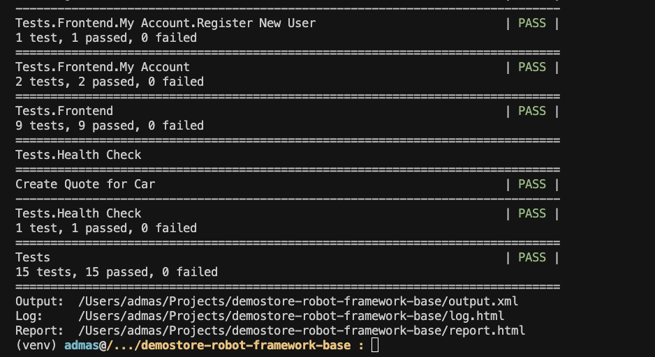
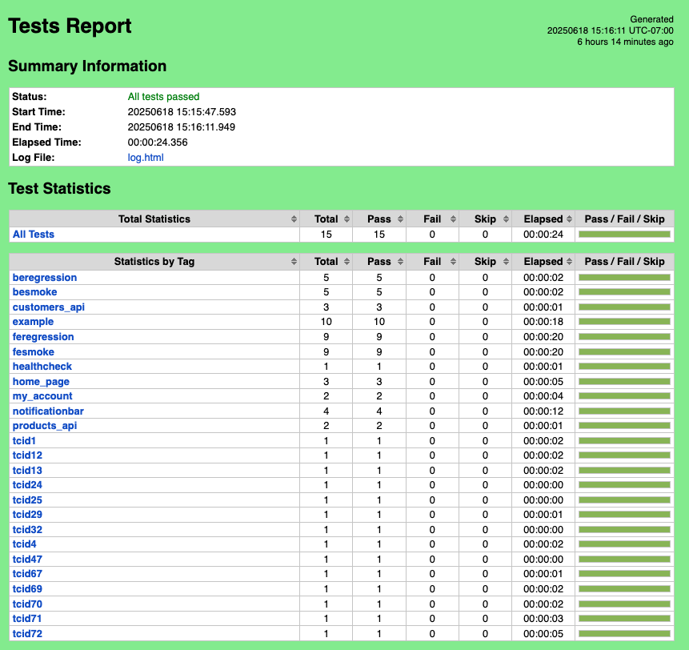
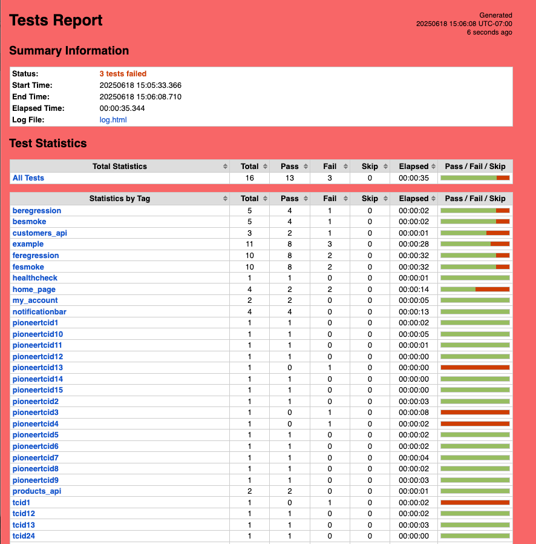

# Robot Framework Test Automation for E-Commerce Site (WooCommerce + WordPress)

## Description
Automated tests using Python & Robot Framework for an ecommerce site. The site under test is created using WordPress, Woocommerce and the StoreFront theme.
Example site for testing: http://demostore.supersqa.com/

## Project Structure
- **libraries/**: Contains helper functions and configurations.
- **tests/**: Includes all the test cases organized by frontend and backend.
- **requirements.txt**: Lists all the dependencies required to run the project.
- **run_tests_by_file_path.sh**: Script to run tests by specifying file paths.
- **run_tests_by_tag.sh**: Script to run tests by specifying tags.

##  🛠 Prerequisites to run the tests
* You must have the E-Commerce site running
* The site must be created with WordPress & WooCommerce
* The site must be using the "StoreFront" theme
* For a tutorial on how to create a site to run these tests on, watch these videos
  * [Creating Ecommerse Site for Testing - Part 1](https://www.youtube.com/watch?v=KhLGXIxeJLI&t=1s&ab_channel=SuperSQA)
  * [Creating Ecommerse Site for Testing - Part 2](https://www.youtube.com/watch?v=w47JR3aoTNw&ab_channel=SuperSQA)
  * [Creating Ecommerse Site for Testing - Part 3](https://www.youtube.com/watch?v=qwCY8UEWqqM&ab_channel=SuperSQA)

## 🚀 Steps for setting up the framework and running tests

### Clone the code
```
git clone git@github.com:supersqa1/Robot-Framework-Ecommerce-Lite.git
cd Robot-Framework-Ecommerce-Lite
```

### Create virtual environment and install requirements
Create a virtual environment
```
python3 -m venv venv_rf
```

### Activate the virtual environment 
  - On Mac/Linux
    ```commandline
    $ source  venv_rf/bin/activate
    ```

  - On 'Windows CMD'
    ```commandline
    C:\..\venv_rf\Scripts\activate.bat
    ```

  - On 'Windows PowerShell'
    ```commandline
    C:\..\venv_rf\Scripts\Activate.ps1
    ```
### Install requirements in the virtual environment
```commandline
python3 -m pip install -r requirements.txt
```

### Running
There are variables required by the framework. 
Some of these value can be changed directly in the code instead of setting environment variables 
but setting the environment variables is the easiest option.
To change values in the code change them here: libraries/configs/MainConfigs.py

The Easiest way to set the variables is to set them in a file and run/source the file.
For 'Mac/Linux' systems, update and run the 'variables_local.sh' file.

```
source variables_local.sh
```

For 'Windows' using 'CMD' run the 'variables_local.bat' file.
```commandline
C:\..\variables_local.bat
```

Here are the variables that must be set
(For Windows on CMD replace 'export' with 'set')
```commandline
export BASE_URL=<your website url>
export BROWSER=<browser type>
export RESULTS_DIR=$(pwd)/results
export ENVIRONMENT=<environment name>  # e.g., dev, test, staging, prod
export DB_PORT_OVERRIDE=<your database port>
export DB_HOST_OVERRIDE=<your database host>
export DB_DATABASE_OVERRIDE=<your site's database/schema name>
export DB_TABLE_PREFIX_OVERRIDE=<your site's tables prefix>

# credentials (these should not be kept in source control like GitHub)
export WOO_KEY=<your woocommerce api key>
export WOO_SECRET=<your woocommerce api secret>
export DB_USER=<your database user>
export DB_PASSWORD=<your database password>
```

Example:
```commandline
export BASE_URL=http://localhost:8888/localdemostore/
export BROWSER=chrome
export RESULTS_DIR=$(pwd)/results
export DB_PORT=8889
export DB_HOST=localhost
export DB_DATABASE=localdemostore
export DB_TABLE_PREFIX=wp_
# credentials (these should not be kept in source controle like GitHub)
export WOO_KEY=<your_woocommerce_api_key>
export WOO_SECRET=<your_woocommerce_api_secret>
# credentials for the wordpress/mysql database
export DB_USER=root
export DB_PASSWORD=root
```

## Run tests
#### To run all tests
** Make sure virtual environment is active
** Explore the 'run_*.sh' (For Mac/Linux) and consider using it.

```commandline
robot \
--pythonpath=. \
--variable=BROWSER:${BROWSER} \
-L debug \
tests
```

#### To run frontend tests
```commandline
robot \
--pythonpath=. \
--variable=BROWSER:${BROWSER} \
-L debug \
tests/frontend
```
#### To run backend tests
```commandline
robot \
--pythonpath=. \
--variable=BROWSER:${BROWSER} \
-L debug \
tests/backend
```

#### To run specific test by id
```commandline
robot \
--pythonpath=. \
--variable=BROWSER:${BROWSER} \
-L debug \
--include tcid33 \
tests
```
---

## 📄 Example Test Case
```robot
*** Test Cases ***
Guest User Can Checkout
    [Tags]    smoke    checkout
    HomePage.go_to_home_page
    HomePage.click_first_add_to_cart_button
    Header.click_on_cart_on_right_header
    CartPage.click_on_proceed_to_checkout
    CheckoutPage.fill_in_billing_info
    CheckoutPage.click_place_order
    OrderReceivedPage.verify_order_received_page_loaded
```

---

## 🖼 Sample Output







_Replace above with real screenshots of the terminal test run and the Robot HTML report._

---

## 🤝 Connect with Me
- [LinkedIn](https://www.linkedin.com/in/admaskinfu/)

---

**Note:** This is a companion to the PyTest-based version: [PyTest-Framework-Ecommerce-Lite](https://github.com/supersqa1/PyTest-Framework-Ecommerce-Lite)